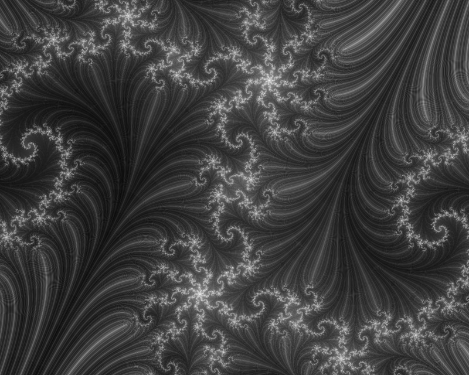

Fractal
=======

This package is an attempt to play with Fractals in the Complex plane with haskell.
It uses the *Repa* array library for processing and saving of images.
Get repa here: [Repa](http://hackage.haskell.org/package/repa-2.0.0.4)

Usage
-----
* Clone the repository
* Initiate a sandbox: `cabal sandbox init`
* Install dependencies: `cabal install --dependencies-only`
* And build: `cabal build`

Preview
-------
This is how the output of the program might look like.

Structure
---------

* main.hs: Contains functions relative to the processing of arrays.
* Julia.hs: Contains a set of function of form `z**2+c` which looked interesting.
* Rendering.hs: Contains all functions relative to the rendering of fractals with the Julia method
    (escape-time algorithm and orbit traps).
* RealFuntions.hs: Useful functions on real numbers, to map intensity and stuff.
* ComplexFunctions.hs: Miscellaneous functions of the form `Complex -> Real` or `Complex -> Complex` 
